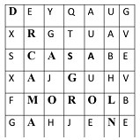
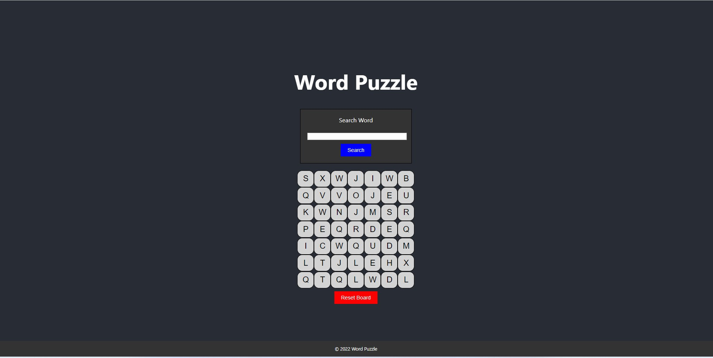
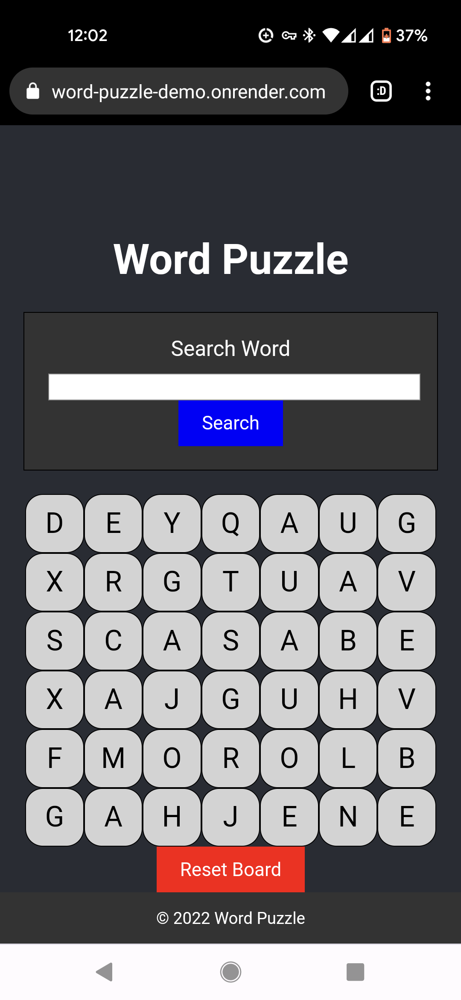
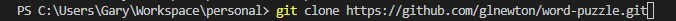
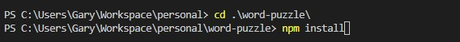
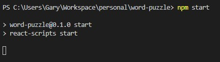
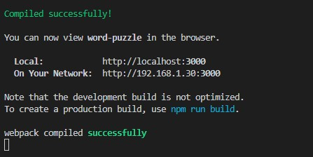

# Word Puzzle

## About

A word puzzle game similar to Boggle or Scrabble.

[GitHub Repository](https://github.com/glnewton/word-puzzle)

[Live Site](https://word-puzzle-demo.onrender.com/)

[Requrirements](./docs/Summary.txt)

## Screenshots

## Build Status

Project is a statically deployed via Render and is connected to the GitHub Repository to redploy on new commits/pushes.

## Code Style

Elements of both functional programming and object-oriented programming are used in this project.

## Technologies, Language Features & Libraries Used

- HTML/CSS
- JavaScript
- React

## Features

1. Built with Create-React-App
2. Hosted on Render
3. Responsive mobile design 

## Installation Instructions

**Step 1: Clone (or fork) the repository**

Run the following code in your terminal to download the code:

`git clone https://github.com/glnewton/word-puzzle.git`

**Step 2: Run NPM Install to install necessary packages**

**Step 3: Run NPM Start to locally run the start scripts fo CRA (Create-React-App)**

## Game Mechanics:

1. Type word into search to search horizontally, reverse horizontally, vertically, or diagonally.
2. Click 'Reset Board' button to create a new word board.

## Known Issues:

- Edge case that errors exist on some diagonal searches for partial words (matrix out of bounds error?).
- I give the position of the start of the word, but is the position of the matrix and submatrix (X is the sub matrix (row) and starts from zero in the upper left hand corner. Y is the position in the row starting at zero from the left.)
- I do not yet cite the end position of the word
- Clicking Reset Board generates a random array and it can be searched ONCE. It then defaults back to the given array imported via the data.js file
PARROT is not found in the array. I believe it was a translation error as LORO is found and is the masculine translation of PARROT.

## Hypothetical Roadmap

- Fix Reset Board so that the matrix data does not revert after one search.
- Create highlight feature that finds the one and highlights the individual letters in yellow.
- Create introductory modal with instructions and start button
- Create tests

## Acknowledgements

- Jeff & Richard for some Q&A and mini demos.

## Disclaimer

I am not affliated with any of the above and all work used is for educational and demonstration purposes only. No profit is generated from this project.

## Resources

- General Google Fu

## License

MIT License

MIT © [Gary Newton]()
